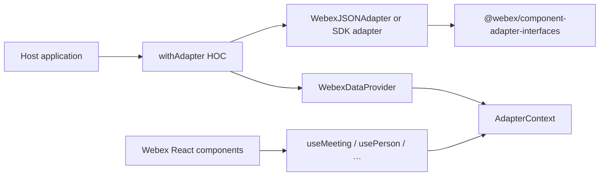
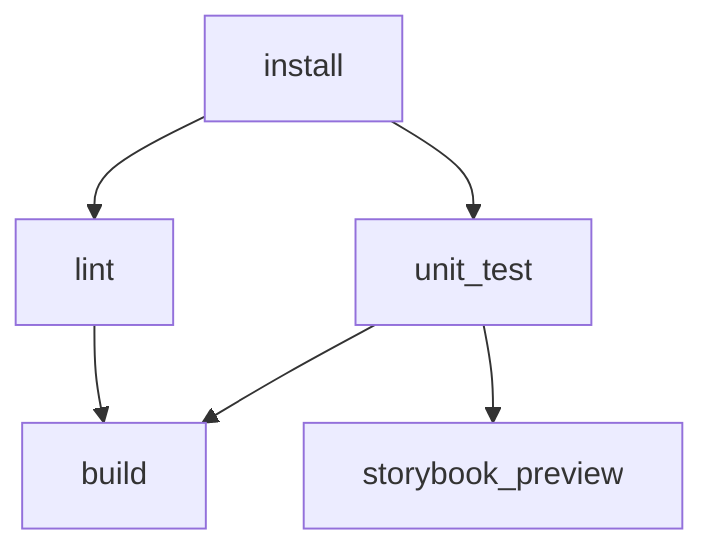

# components — ai-docs/ARCHITECTURE.md

Repositorio: webex/components
Descripcion del repositorio: Embed the power of Webex in your web applications, on your own terms 💪🏼

<!-- ───────────────────────────────
  Template:     ARCHITECTURE
  Template-ID:  architecture
  Generates:    ai-docs/ARCHITECTURE.md
  Description:  Repo/component architecture — components, responsibilities, interactions, cross-cutting posture.
  Library ver:  0.2.1
  Last updated: 2026-07-27
─────────────────────────────── -->

# ARCHITECTURE — webex/components

> Start here → root [`AGENTS.md`](../AGENTS.md) · router [`SPEC_INDEX.md`](SPEC_INDEX.md). Per-module detail in manifest-routed module specs.

## Design Overview

**@webex/components** is a single-package React library (topology: Single-repo) that separates **presentation** (React components under `src/components/`) from **data access** (adapters under `src/adapters/` implementing `@webex/component-adapter-interfaces`). Host applications either wrap components with `withAdapter` and a live SDK adapter factory, or use the bundled JSON adapters for demos and Storybook.

Rollup produces ES and UMD bundles plus compressed CSS, theme folders, and font assets. The library is published to npm; hosts embed components and supply meeting/messaging data through adapter observables (RxJS).

## Component Inventory & Responsibilities

| Component | Responsibility (one line) | Docs |
|---|---|---|
| `src/components/` | Webex-styled React UI, hooks, HOCs, generic primitives | `src/components/ai-docs/components-spec.md` |
| `src/adapters/` | JSON-backed adapter implementations for offline/demo data | `src/adapters/ai-docs/adapters-spec.md` |
| `src/styles/` + `src/themes/` + `src/assets/` | Global SCSS, theme tokens, fonts copied to dist | `src/styles/ai-docs/styles-themes-spec.md` |

## Component Interaction

Narrative: Host creates an adapter (JSON datasource object or SDK-backed factory). `withAdapter` instantiates the adapter, calls `connect()`, then wraps output in `WebexDataProvider`. Child components use hooks (`useMeeting`, `usePerson`, etc.) that read from `AdapterContext` and subscribe to adapter observables. Meeting controls delegate to adapter control objects (e.g. `MeetingsJSONAdapter` control classes).

## Execution & Flow

**Embed & render flow (library consumer):**

1. Host installs `@webex/components` and peer dependencies.
2. Host imports components and CSS (`dist/css/webex-components.css`).
3. Host wraps a tree with `withAdapter(MyView, adapterFactory)` or provides `WebexDataProvider`.
4. Component hooks subscribe to adapter streams; UI updates on observable emissions.
5. User actions invoke adapter control methods (join, mute, roster toggle, etc.).

Evidence: `src/components/hoc/withAdapter.jsx`, `src/components/WebexDataProvider/WebexDataProvider.jsx`, `src/components/hooks/useMeeting.js`.

## Dependencies

| Dependency | Type | How used | Failure / version handling |
|---|---|---|---|
| `@webex/component-adapter-interfaces` | external npm | Adapter base classes and meeting state enums | Pinned in `package.json`; alias in Rollup config |
| `react` / `react-dom` | peer | UI rendering | Excluded from bundle; host must supply 18.3.1 |
| `rxjs` | peer | Adapter observables | Excluded from bundle |
| `prop-types` | peer | Runtime prop validation | Excluded from bundle |
| `adaptivecards-templating`, `markdown-it`, etc. | npm dep | Adaptive cards and markdown in messaging UI | Bundled; version pinned in `package.json` |

### State Model

- **React local state:** Component-level UI state (modals, layout, dimensions) via hooks.
- **Adapter-driven state:** Meeting membership, media, controls — sourced from adapter observables, not local persistence.
- **Context:** `AdapterContext`, `MeetingContext` propagate adapter and meeting scope.

Evidence: `src/components/hooks/contexts.js`, `src/adapters/MeetingsJSONAdapter.js`.

## Domain Data Across Components

Meeting, people, room, activity, and membership data flows through **adapter observables** — not shared in-repo stores. Components module hooks subscribe; adapters module owns JSON/SDK-shaped state mutations. Styles module has no domain data.

Evidence: `src/adapters/MeetingsJSONAdapter.js`, `src/components/hooks/useMeeting.js`.

## Shared Base Libraries

| Shared asset | Location | Used by |
|---|---|---|
| `src/constants.js` | Class prefix, ARIA strings | components, styles |
| `src/util.js` | deepMerge, rxjs chainWith, URL validation | adapters, components |
| `@webex/component-adapter-interfaces` | Adapter contracts (external) | adapters, components hooks |
| Generic UI (`Button`, `Modal`, …) | `src/components/generic/` | Webex feature components |

Evidence: `src/index.js`, `src/util.js`, `package.json`.

## Cross-Cutting Concerns

- **Security:** Library runs in host browser context; hosts must protect access tokens. Components do not persist credentials. URL validation via `src/util.js` `isValidUrl`.
- **Observability:** No server-side logging; optional `useMetrics` hook for host integration. Storybook/Chromatic for visual regression.
- **Accessibility:** Components use ARIA labels; shared constants for disabled media states in `src/constants.js`.
- **Styling:** BEM-like `wxc-` prefixed classes from SCSS; themes under `src/themes/dark.scss` and `src/themes/light.scss`.

## Build & Packaging

Rollup entry `src/index.js` emits:

- `dist/es/webex-components.es.js` (+ minified)
- `dist/umd/webex-components.umd.js` (+ minified)
- `dist/css/webex-components.css`
- `dist/themes/` (copied from `src/themes/dark`, `src/themes/light`)
- `dist/assets/fonts/` (copied from `src/assets/fonts`)

Evidence: `rollup.config.js`, `package.json` `files` and `module`/`main` fields.

## Release & Versioning

- **Publish target:** npm public registry (`@webex/components`, access public per `package.json`).
- **Versioning:** semantic-release automates version bumps — do not manually edit version for releases.
- **Deprecation:** Beta status per README; breaking changes documented in CHANGELOG.
- **Consumer changelog:** `CHANGELOG.md` maintained by semantic-release.

Evidence: `package.json`, `README.md`, `.circleci/config.yml`.

## Host Integration & Theming

- Host installs peer deps: `react@18.3.1`, `react-dom@18.3.1`, `rxjs`, `prop-types`.
- Host imports `dist/css/webex-components.css` and optionally theme assets from `dist/themes/`.
- Host wraps UI with `withAdapter(Component, factory)` or `WebexDataProvider`.
- Production Webex data: use `@webex/sdk-component-adapter` (external repo) — not bundled here.
- Class prefix `wxc` and theme SCSS must stay aligned across JS and CSS.

Evidence: `README.md`, `src/components/hoc/withAdapter.jsx`, `package.json` peerDependencies.

## Cross-Repo Dependency Graph

- **Consumed (external npm):** `@webex/component-adapter-interfaces` — adapter type contracts.
- **Consumed (external, production hosts):** `@webex/sdk-component-adapter` — live Webex SDK adapter (not in this repo).
- **Related product:** [Webex Widgets](https://github.com/webex/widgets) — higher-level widgets built on components + SDK adapter.
- **Published artifact:** `@webex/components` npm package consumed by host applications and widgets.
- **SDD tooling source:** `SDLC-Skills` plugin installed locally (not a runtime dependency).

Evidence: `README.md`, `package.json`.

## Testing & Quality

- Jest unit/snapshot tests co-located with components and adapters.
- Storybook documents components at https://webex.github.io/components/storybook.
- CircleCI workflow `test_and_storybook` (see `.circleci/config.yml`):
  - `install` → `lint` and `unit_test` run in parallel (both require install).
  - `storybook_preview` (Chromatic via `npm run chromatic`) runs after `unit_test` on **non-master** branches only.
  - `build` runs after both `lint` and `unit_test` on **master** only.

Evidence: `.circleci/config.yml`, `package.json` scripts.

## Architecture Reference Links

| Reference | Location | When to read |
|---|---|---|
| Repo patterns | `patterns/` | Implementation conventions (withAdapter, class prefix, co-located tests) |
| Enforceable rules | `RULES.md` | Coverage map, testing, and security must-dos |
| Security baseline | `SECURITY.md` | Trust boundaries before auth/token-related UI changes |
| Review checks | `REVIEW_CHECKLIST.md` | Before merge of spec-affecting changes |

---
> Fuente: https://github.com/webex/components/blob/master/ai-docs/ARCHITECTURE.md (licencia MIT)
