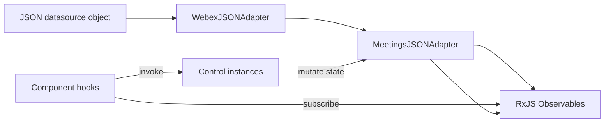
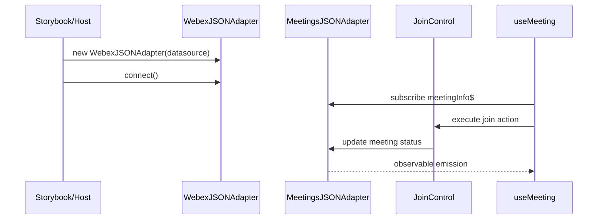
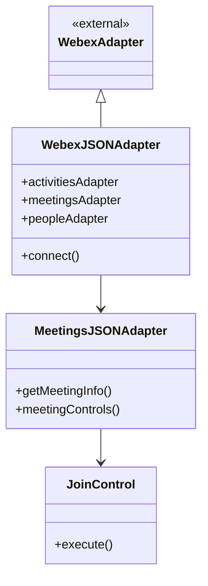

# components — src/adapters/ai-docs/adapters-spec.md

Repositorio: webex/components
Descripcion del repositorio: Embed the power of Webex in your web applications, on your own terms 💪🏼

<!-- ───────────────────────────────
  Template:     Module Spec
  Template-ID:  module-spec
  Generates:    src/adapters/ai-docs/adapters-spec.md
  Description:  Per-module canonical spec — orientation plus requirements, design, invariants, flows, pitfalls, and tests.
  Library ver:  0.2.1
  Last updated: 2026-07-27
─────────────────────────────── -->

# adapters — SPEC

> Start here → root [`AGENTS.md`](../../../AGENTS.md) · router [`SPEC_INDEX.md`](../../../ai-docs/SPEC_INDEX.md) · system [`ARCHITECTURE.md`](../../../ai-docs/ARCHITECTURE.md).

## Metadata

| Field | Value |
|---|---|
| Module id | adapters |
| Source path(s) | `src/adapters/` |
| Doc kind | Module spec |
| Coverage score | 97% assessed 2026-07-23 — all domain adapters and meeting controls documented |
| Generated from | `module-spec` @ SDLC template library `0.2.1` |
| generated_by / approved_by / updated_at | cursor-agent-session / pending PR approval / 2026-07-23 |
| Validation status | pass-with-warnings, validator codex-agent-session, assessed 2026-07-23 (0 blocking) |

## Evidence Rules

Requirements cite adapter source and co-located `*.test.js` files. Observable behavior validated against `@webex/component-adapter-interfaces` types.

## Source Material Register

| Source material | Scope | Decision | Detail location |
|---|---|---|---|
| `@webex/component-adapter-interfaces` | adapter API | reference-only | Requires section; npm package |
| Datasource modules | demo data | verified | `src/data/*.js` (`activities.js`, `meetings.js`, …) |

## Overview

The **adapters** module provides JSON-backed implementations of Webex component adapter interfaces for offline development, Storybook, and tests. `WebexJSONAdapter` is the façade that wires domain-specific JSON adapters (meetings, people, rooms, activities, memberships, organizations).

`MeetingsJSONAdapter` is the largest adapter — it models meeting state, media streams, roster, settings, and meeting controls as RxJS observables with control class instances.

## Purpose / Responsibility

Supply in-memory/Webex-shaped data and control semantics to React components without a live Webex SDK connection. Does **not** implement network I/O or token management.

## Stack

- JavaScript ES modules
- RxJS (`Observable`, operators) for reactive meeting/people streams
- Extends classes from `@webex/component-adapter-interfaces`
- Jest tests co-located with adapters

## Folder / Package Structure

```
src/adapters/
├── WebexJSONAdapter.js           # Root JSON adapter façade
├── MeetingsJSONAdapter.js        # Meetings domain + controls
├── MeetingsJSONAdapter/controls/ # Join, mute, share, roster, … controls
├── PeopleJSONAdapter.js
├── RoomsJSONAdapter.js
├── ActivitiesJSONAdapter.js
├── MembershipJSONAdapter.js
├── OrganizationsJSONAdapter.js
├── index.js                      # Module barrel (internal; not package root)
└── *.test.js                     # Domain adapter tests
```

## Key Files (source of truth)

| File | Holds |
|---|---|
| `src/adapters/WebexJSONAdapter.js` | Façade wiring datasource keys to domain adapters |
| `src/adapters/MeetingsJSONAdapter.js` | Meeting state machine, observables, control registry |
| `src/adapters/MeetingsJSONAdapter/controls/index.js` | Control exports |
| `src/adapters/index.js` | Adapter module barrel (internal); only `WebexJSONAdapter` is npm-exported via `src/index.js` |
| `src/util.js` | `deepMerge` used by MeetingsJSONAdapter |

## Public Surface

Only `WebexJSONAdapter` is published from `@webex/components` (`src/index.js` → Rollup package entry). Domain adapters are internal implementation composed by the façade.

| Contract ID | Type | Surface | Purpose | Compatibility | Detail link | Root index |
|---|---|---|---|---|---|---|
| adapters.WebexJSONAdapter | npm package export | class | Entry JSON adapter façade | Semver | `src/adapters/WebexJSONAdapter.js` | `ai-docs/CONTRACTS.md` |

**Internal adapter-barrel exports (not npm package API)** — exported from `src/adapters/index.js` for module tests and Storybook; accessed in apps via `WebexJSONAdapter` domain properties (`meetingsAdapter`, `peopleAdapter`, …):

| Contract ID | Type | Surface | Purpose | Detail link |
|---|---|---|---|---|
| adapters.MeetingsJSONAdapter | internal | class | Meeting observables + controls | `src/adapters/MeetingsJSONAdapter.js` |
| adapters.PeopleJSONAdapter | internal | class | People search/display data | `src/adapters/PeopleJSONAdapter.js` |
| adapters.RoomsJSONAdapter | internal | class | Space/room data | `src/adapters/RoomsJSONAdapter.js` |
| adapters.ActivitiesJSONAdapter | internal | class | Activity stream data | `src/adapters/ActivitiesJSONAdapter.js` |
| adapters.MembershipJSONAdapter | internal | class | Membership/roster data | `src/adapters/MembershipJSONAdapter.js` |
| adapters.OrganizationsJSONAdapter | internal | class | Organization data | `src/adapters/OrganizationsJSONAdapter.js` |

## Requires (dependencies)

- `@webex/component-adapter-interfaces` — base adapter classes, `MeetingState`, control interfaces
- `rxjs` — observables and operators
- `src/util.js` — `deepMerge` for meeting state updates
- Datasource object with keys: `activities`, `meetings`, `memberships`, `organizations`, `people`, `rooms`

Evidence: `src/adapters/WebexJSONAdapter.js` constructor.

## Requirements

| ID | WHAT | WHY | Source Evidence | Test Evidence | Gaps | Confidence |
|---|---|---|---|---|---|---|
| ADP-R-001 | `WebexJSONAdapter` MUST extend `WebexAdapter` and construct six domain adapters | Single entry point for JSON demo data | `src/adapters/WebexJSONAdapter.js` | adapter integration tests | none | PRESENT |
| ADP-R-002 | `connect()` / `disconnect()` MUST resolve immediately for JSON adapters | No async network | `src/adapters/WebexJSONAdapter.js` | — | none | PRESENT |
| ADP-R-003 | `MeetingsJSONAdapter` MUST expose meeting control constants (join, mute, share, …) | UI maps controls by ID | `src/adapters/MeetingsJSONAdapter.js` | `src/adapters/MeetingsJSONAdapter.test.js` | none | PRESENT |
| ADP-R-004 | Meeting state updates MUST use RxJS observables | Components subscribe via hooks | `src/adapters/MeetingsJSONAdapter.js` | MeetingsJSONAdapter tests | none | PRESENT |
| ADP-R-005 | Each registered meeting control MUST map to a control class instance in `meetingControls` | Components invoke controls by ID | `src/adapters/MeetingsJSONAdapter.js`, `src/adapters/MeetingsJSONAdapter/controls/` | `MeetingsJSONAdapter.test.js` | `DISABLED_JOIN_CONTROL` defined but not registered | PRESENT |
| ADP-R-006 | Datasource MUST provide keys: activities, meetings, memberships, organizations, people, rooms | WebexJSONAdapter constructor contract | `src/adapters/WebexJSONAdapter.js` | adapter tests | none | PRESENT |
| ADP-R-007 | Each domain adapter MUST extend matching interface adapter class | Interface compliance | `src/adapters/PeopleJSONAdapter.js` | PeopleJSONAdapter.test.js | none | PRESENT |

## Design Overview

JSON adapters mirror the SDK adapter shape so components do not branch on data source. `WebexJSONAdapter` delegates to focused adapters per domain. `MeetingsJSONAdapter` centralizes meeting lifecycle (NOT_JOINED → joined states), media permissions, roster visibility, and settings preview — emitting updates through observables consumed by component hooks.

Control objects encapsulate imperative actions (join, leave, mute audio/video, share screen, device switching) and mutate in-memory meeting state.

## Data Flow



## Sequence Diagram(s)

Sequence coverage:

| Operation group | Diagram | Failure / recovery coverage |
|---|---|---|
| JSON adapter connect + join control | below | invalid meeting ID handled per control tests |



## Class / Component Relationships



## Use Cases

| UC | Description | Evidence |
|---|---|---|
| UC-1 Storybook demo | Instantiate `WebexJSONAdapter` with static JSON from `src/data/*.js` | `.storybook/` stories |
| UC-2 Unit test | Inject JSON adapter into `WebexDataProvider` | component tests |
| UC-3 Control interaction | User clicks join → `JoinControl` updates state | `MeetingsJSONAdapter/controls/JoinControl.js` |

## State Model

In-memory meeting and domain records live on the JSON datasource object passed to `WebexJSONAdapter`. `MeetingsJSONAdapter` mutates meeting entries via `deepMerge` when controls fire; other domain adapters read/write their respective datasource slices.

| State store | Owner | Notes |
|---|---|---|
| Datasource object | host/test/Storybook | Keys: activities, meetings, memberships, organizations, people, rooms |
| Meeting entries | MeetingsJSONAdapter | Status, media flags, roster visibility updated by controls |
| Observable caches | per adapter method | RxJS streams emit on mutation |

Evidence: `src/adapters/WebexJSONAdapter.js`, `src/adapters/MeetingsJSONAdapter.js`, `src/util.js`.

## Concurrency & Reactive Flow

Meeting updates propagate via RxJS `Observable` streams. Multiple subscribers (hooks) share hot/cold patterns as implemented per adapter method — components must unsubscribe on unmount (handled in hooks).

Evidence: `src/adapters/MeetingsJSONAdapter.js`, rxjs imports.

## Error Handling & Failure Modes

JSON adapters surface invalid inputs and missing records through RxJS `observer.error(...)` on subscribed observables. Callers (hooks, tests, Storybook) MUST handle error emissions — errors are not swallowed or converted to silent empty results.

| Condition | Signal (error/code/result) | Caller recovery |
|---|---|---|
| Unknown meeting ID | `observer.error(Error('Could not find meeting with ID "…"'))` | Subscribe with error handler; show fallback UI | 
| Unknown person ID or search miss | `observer.error(Error('Could not find person…'))` | Guard UI before subscribe; handle error in hook |
| Unknown room ID | `observer.error(Error('Could not find room with ID "…"'))` | Show not-found state; avoid assuming room exists |
| Unknown activity ID | `observer.error(Error('Could not find activity with ID "…"'))` | Handle in activity stream subscription |
| Unknown organization ID | `observer.error(Error('Could not find any organization with ID "…"'))` | Handle in organization lookup |
| Invalid membership destination | `observer.error(Error('Could not find members for destination "…"'))` | Validate destination before subscribe |
| Room creation failure | `observer.error(Error('error in creating room'))` | Retry or surface error to host |
| Control preconditions not met (switch camera/mic/speaker) | `observer.error(Error('Could not find meeting with ID "…" to add … control'))` | Guard control UI until meeting exists |
| Activity attachment/post failure | `observer.error(Error('Unable to create/post…'))` | Show error toast; do not assume success |

Evidence: `src/adapters/MeetingsJSONAdapter.js`, `src/adapters/PeopleJSONAdapter.js`, `src/adapters/RoomsJSONAdapter.js`, `src/adapters/ActivitiesJSONAdapter.js`, `src/adapters/MembershipJSONAdapter.js`, `src/adapters/OrganizationsJSONAdapter.js`, `src/adapters/MeetingsJSONAdapter/controls/*.js`.

## State Machine

Meeting status transitions include `NOT_JOINED` and joined/in-meeting states aligned with `MeetingState` from `@webex/component-adapter-interfaces`. Controls gate transitions (e.g. join, leave).

Evidence: `src/adapters/MeetingsJSONAdapter.js` `EMPTY_MEETING`, status field.

## Meeting Controls Registry

Registered controls instantiated in `meetingControls`:

| Control constant | Control class | Purpose |
|---|---|---|
| `JOIN_CONTROL` | `JoinControl` | Join meeting |
| `LEAVE_CONTROL` | `LeaveControl` | Leave meeting |
| `MUTE_AUDIO_CONTROL` | `MuteAudioControl` | Toggle audio mute |
| `MUTE_VIDEO_CONTROL` | `MuteVideoControl` | Toggle video mute |
| `SHARE_CONTROL` | `ShareControl` | Screen share |
| `ROSTER_CONTROL` | `RosterControl` | Toggle roster |
| `SETTINGS_CONTROL` | `SettingsControl` | Open settings |
| `SWITCH_CAMERA_CONTROL` | `SwitchCameraControl` | Switch camera device |
| `SWITCH_MICROPHONE_CONTROL` | `SwitchMicrophoneControl` | Switch microphone |
| `SWITCH_SPEAKER_CONTROL` | `SwitchSpeakerControl` | Switch speaker |
| `DISABLED_MUTE_AUDIO_CONTROL` | `DisabledMuteAudioControl` | Disabled mute state |

**Defined constants not registered in `meetingControls`:**

| Constant | ID string | Status |
|---|---|---|
| `DISABLED_JOIN_CONTROL` | `disabled-join-meeting` | Exported constant only — no control class and not in `supportedControls()` |

Evidence: `src/adapters/MeetingsJSONAdapter.js`, `src/adapters/MeetingsJSONAdapter/controls/`, `src/adapters/MeetingsJSONAdapter.test.js`.

## Domain Adapter Summary

| Adapter | Source file | Test file |
|---|---|---|
| ActivitiesJSONAdapter | `src/adapters/ActivitiesJSONAdapter.js` | `ActivitiesJSONAdapter.test.js` |
| MeetingsJSONAdapter | `src/adapters/MeetingsJSONAdapter.js` | `MeetingsJSONAdapter.test.js` |
| MembershipJSONAdapter | `src/adapters/MembershipJSONAdapter.js` | `MembershipJSONAdapter.test.js` |
| OrganizationsJSONAdapter | `src/adapters/OrganizationsJSONAdapter.js` | `OrganizationsJSONAdapter.test.js` |
| PeopleJSONAdapter | `src/adapters/PeopleJSONAdapter.js` | `PeopleJSONAdapter.test.js` |
| RoomsJSONAdapter | `src/adapters/RoomsJSONAdapter.js` | `RoomsJSONAdapter.test.js` |

## Pitfalls

- Datasource must include all keys expected by `WebexJSONAdapter` constructor.
- Meeting control IDs are string constants — must stay aligned with component control bar mapping.
- `deepMerge` mutates destination objects — callers must pass clones if immutability required.
- Do not treat domain adapter classes as npm public API — only `WebexJSONAdapter` is published from `src/index.js`.

Evidence: `src/adapters/WebexJSONAdapter.js`, `src/util.js`, `src/index.js`.

## Export Stability

Only `WebexJSONAdapter` is a semver-managed npm export from `@webex/components`. Internal domain adapter classes may change without a major bump as long as the façade shape and `@webex/component-adapter-interfaces` compliance are preserved.

Evidence: `src/index.js`, `ai-docs/CONTRACTS.md`.

## Host Integration & Theming

Hosts typically construct `WebexJSONAdapter` with a datasource object (often from `src/data/*.js` modules in demos) and pass the instance to `withAdapter` or `WebexDataProvider`. Production hosts should use `@webex/sdk-component-adapter` instead of JSON adapters.

Evidence: `README.md`, `.storybook/`, `src/data/index.js`.

## Test-Case Strategy (module)

- Domain tests: `MeetingsJSONAdapter.test.js`, `PeopleJSONAdapter.test.js`, etc.
- Assert observable emissions and control side effects.
- Mock datasource objects inline in tests.

| Behavior / Requirement | Existing test evidence | Gap |
|---|---|---|
| ADP-R-005 control registry | `MeetingsJSONAdapter.test.js` | none for unregistered `DISABLED_JOIN_CONTROL` |
| ADP-R-003 control constants | `MeetingsJSONAdapter.test.js` | none |

Evidence: `src/adapters/*.test.js`.

## Traceability

| Requirement | Code | Tests |
|---|---|---|
| ADP-R-001 | `src/adapters/WebexJSONAdapter.js` | adapter tests |
| ADP-R-002 | `src/adapters/WebexJSONAdapter.js` | — |
| ADP-R-003 | `src/adapters/MeetingsJSONAdapter.js` | `MeetingsJSONAdapter.test.js` |
| ADP-R-004 | `src/adapters/MeetingsJSONAdapter.js` | MeetingsJSONAdapter tests |
| ADP-R-005 | `src/adapters/MeetingsJSONAdapter/controls/` | `MeetingsJSONAdapter.test.js` |
| ADP-R-006 | `src/adapters/WebexJSONAdapter.js` | adapter tests |
| ADP-R-007 | `src/adapters/PeopleJSONAdapter.js` | PeopleJSONAdapter.test.js |

- Repo architecture: [`ai-docs/ARCHITECTURE.md`](../../../ai-docs/ARCHITECTURE.md) · Registry: [`ai-docs/SPEC_INDEX.md`](../../../ai-docs/SPEC_INDEX.md)
- Coverage state & contracts baseline: `.sdd/manifest.json`

---
> Fuente: https://github.com/webex/components/blob/master/src/adapters/ai-docs/adapters-spec.md (licencia MIT)
