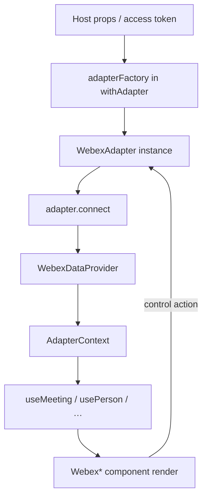
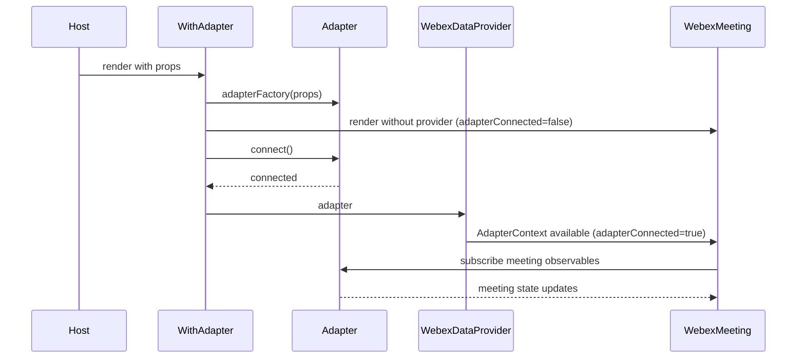
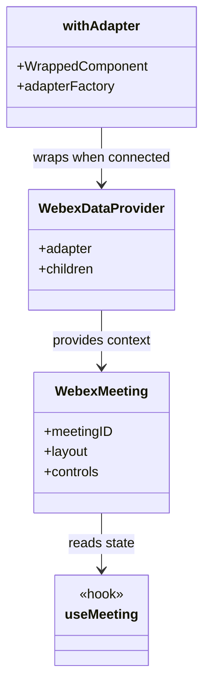
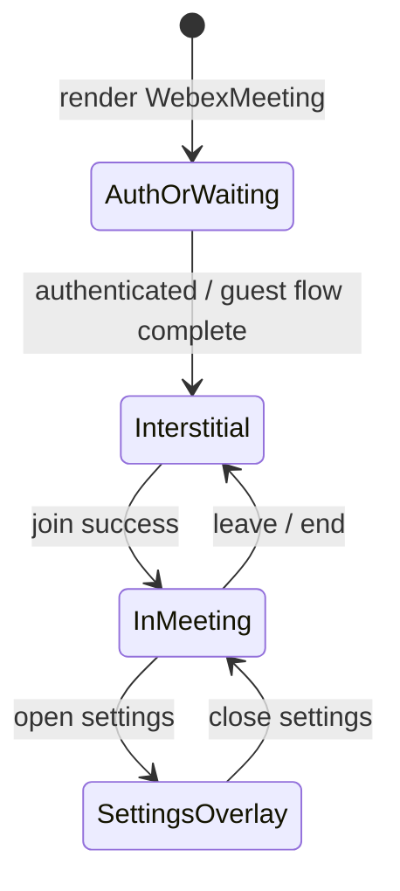

# components — src/components/ai-docs/components-spec.md

Repositorio: webex/components
Descripcion del repositorio: Embed the power of Webex in your web applications, on your own terms 💪🏼

<!-- ───────────────────────────────
  Template:     Module Spec
  Template-ID:  module-spec
  Generates:    src/components/ai-docs/components-spec.md
  Description:  Per-module canonical spec — orientation plus requirements, design, invariants, flows, pitfalls, and tests.
  Library ver:  0.2.1
  Last updated: 2026-07-27
─────────────────────────────── -->

# components — SPEC

> Start here → root [`AGENTS.md`](../../../AGENTS.md) · router [`SPEC_INDEX.md`](../../../ai-docs/SPEC_INDEX.md) · system [`ARCHITECTURE.md`](../../../ai-docs/ARCHITECTURE.md).

## Metadata

| Field | Value |
|---|---|
| Module id | components |
| Source path(s) | `src/components/`, `src/constants.js`, `src/util.js` |
| Doc kind | Module spec |
| Coverage score | 98% assessed 2026-07-27 — all 31 barrel exports documented in Public Surface; hooks, HOCs, contexts, and internal support folders documented |
| Generated from | `module-spec` @ SDLC template library `0.2.1` |
| generated_by / approved_by / updated_at | cursor-agent-session / pending PR approval / 2026-07-23 |
| Validation status | pass-with-warnings, validator codex-agent-session, assessed 2026-07-23 (0 blocking) |

## Evidence Rules

Every requirement cites `file path` evidence. Test evidence preferred for WHY. Unresolved gaps marked `[NEEDS HUMAN INPUT]` only when code/tests do not support a claim.

## Source Material Register

| Source material | Scope | Decision | Detail location or disposition |
|---|---|---|---|
| Per-component README.md files | component usage | reference-only | Linked from Overview; not canonical |
| Root README.md | package usage | reference-only | GETTING_STARTED / ARCHITECTURE |
| Storybook stories | UI behavior | verified | Use Cases, UI Flow sections |

## Overview

The **components** module is the primary UI surface of `@webex/components`. It contains exported Webex experience components (meetings, messaging, roster, settings, authentication), shared generic widgets (`Button`, `Modal`, …), React hooks that read adapter observables, and HOCs (`withAdapter`, `withMeeting`) that wire adapter lifecycle into the tree.

Internal folders (`icons/`, `inputs/`, `adaptive-cards/`, `generic/`) support exported components but are not all re-exported from `src/components/index.js`.

## Purpose / Responsibility

Owns all React presentation and client-side interaction for Webex component experiences. Does **not** fetch Webex cloud data directly — consumes injected adapters only.

## Stack

- JavaScript (JSX), React 18, PropTypes
- RxJS consumption via hooks (peer dependency)
- Jest + React Testing Library for tests
- SCSS co-located per component; aggregated via `src/styles/index.scss`

## Folder / Package Structure

```
src/components/
├── WebexMeeting/           # Full meeting shell
├── WebexMessaging/         # Messaging UI
├── WebexDataProvider/      # AdapterContext provider
├── hoc/                    # withAdapter, withMeeting
├── hooks/                  # useMeeting, usePerson, contexts
├── generic/                # Button, Modal, Title, …
├── icons/                  # SVG/icon components
├── inputs/                 # Form inputs
├── adaptive-cards/         # Adaptive card rendering
├── index.js                # Public export barrel
├── helpers.js              # className helpers
└── breakpoints.js          # Responsive breakpoints
```

## Key Files (source of truth)

| File | Holds |
|---|---|
| `src/components/index.js` | Public component and hook exports |
| `src/components/hoc/withAdapter.jsx` | Adapter connect/disconnect HOC |
| `src/components/WebexDataProvider/WebexDataProvider.jsx` | AdapterContext provider |
| `src/components/hooks/contexts.js` | AdapterContext, MeetingContext |
| `src/constants.js` | `WEBEX_COMPONENTS_CLASS_PREFIX`, ARIA label constants |
| `src/util.js` | Shared helpers used by components/adapters |

## Public Surface

| Contract ID | Type | Surface | Purpose | Compatibility | Schema / detail link | Root index |
|---|---|---|---|---|---|---|
| components.WebexAvatar | SDK export | `WebexAvatar` component | Avatar display | Semver beta | `src/components/WebexAvatar/WebexAvatar.jsx` | `ai-docs/CONTRACTS.md` |
| components.WebexActivity | SDK export | `WebexActivity` component | Single activity | Semver beta | `src/components/WebexActivity/WebexActivity.jsx` | `ai-docs/CONTRACTS.md` |
| components.WebexActivityStream | SDK export | `WebexActivityStream` component | Activity stream | Semver beta | `src/components/WebexActivityStream/WebexActivityStream.jsx` | `ai-docs/CONTRACTS.md` |
| components.WebexAdaptiveCards | SDK export | `WebexAdaptiveCards` component | Adaptive cards container | Semver beta | `src/components/WebexAdaptiveCards/WebexAdaptiveCards.jsx` | `ai-docs/CONTRACTS.md` |
| components.WebexDataProvider | SDK export | `WebexDataProvider` component | Adapter context provider | Semver beta | `src/components/WebexDataProvider/WebexDataProvider.jsx` | `ai-docs/CONTRACTS.md` |
| components.WebexInMeeting | SDK export | `WebexInMeeting` component | In-meeting layout | Semver beta | `src/components/WebexInMeeting/WebexInMeeting.jsx` | `ai-docs/CONTRACTS.md` |
| components.WebexInterstitialMeeting | SDK export | `WebexInterstitialMeeting` component | Pre-join interstitial | Semver beta | `src/components/WebexInterstitialMeeting/WebexInterstitialMeeting.jsx` | `ai-docs/CONTRACTS.md` |
| components.WebexLocalMedia | SDK export | `WebexLocalMedia` component | Local media display | Semver beta | `src/components/WebexLocalMedia/WebexLocalMedia.jsx` | `ai-docs/CONTRACTS.md` |
| components.WebexMediaAccess | SDK export | `WebexMediaAccess` component | Media permission prompt | Semver beta | `src/components/WebexMediaAccess/WebexMediaAccess.jsx` | `ai-docs/CONTRACTS.md` |
| components.WebexMeeting | SDK export | `WebexMeeting` component | Full meeting shell | Semver beta | `src/components/WebexMeeting/WebexMeeting.jsx` | `ai-docs/CONTRACTS.md` |
| components.WebexMeetingGuestAuthentication | SDK export | `WebexMeetingGuestAuthentication` component | Guest auth UI | Semver beta | `src/components/WebexMeetingGuestAuthentication/WebexMeetingGuestAuthentication.jsx` | `ai-docs/CONTRACTS.md` |
| components.WebexMeetingHostAuthentication | SDK export | `WebexMeetingHostAuthentication` component | Host auth UI | Semver beta | `src/components/WebexMeetingHostAuthentication/WebexMeetingHostAuthentication.jsx` | `ai-docs/CONTRACTS.md` |
| components.WebexMeetingControl | SDK export | `WebexMeetingControl` component | Single meeting control | Semver beta | `src/components/WebexMeetingControl/WebexMeetingControl.jsx` | `ai-docs/CONTRACTS.md` |
| components.WebexMeetingControlBar | SDK export | `WebexMeetingControlBar` component | Control bar | Semver beta | `src/components/WebexMeetingControlBar/WebexMeetingControlBar.jsx` | `ai-docs/CONTRACTS.md` |
| components.WebexMeetingInfo | SDK export | `WebexMeetingInfo` component | Meeting info display | Semver beta | `src/components/WebexMeetingInfo/WebexMeetingInfo.jsx` | `ai-docs/CONTRACTS.md` |
| components.WebexMember | SDK export | `WebexMember` component | Single member row | Semver beta | `src/components/WebexMember/WebexMember.jsx` | `ai-docs/CONTRACTS.md` |
| components.WebexMemberRoster | SDK export | `WebexMemberRoster` component | Member roster | Semver beta | `src/components/WebexMemberRoster/WebexMemberRoster.jsx` | `ai-docs/CONTRACTS.md` |
| components.WebexMessaging | SDK export | `WebexMessaging` component | Messaging UI | Semver beta | `src/components/WebexMessaging/WebexMessaging.jsx` | `ai-docs/CONTRACTS.md` |
| components.WebexRemoteMedia | SDK export | `WebexRemoteMedia` component | Remote media tiles | Semver beta | `src/components/WebexRemoteMedia/WebexRemoteMedia.jsx` | `ai-docs/CONTRACTS.md` |
| components.WebexSettings | SDK export | `WebexSettings` component | Settings panel | Semver beta | `src/components/WebexSettings/WebexSettings.jsx` | `ai-docs/CONTRACTS.md` |
| components.WebexWaitingForHost | SDK export | `WebexWaitingForHost` component | Waiting state UI | Semver beta | `src/components/WebexWaitingForHost/WebexWaitingForHost.jsx` | `ai-docs/CONTRACTS.md` |
| components.SignIn | SDK export | `SignIn` component | Sign-in UI | Semver beta | `src/components/SignIn/SignIn.jsx` | `ai-docs/CONTRACTS.md` |
| components.WebexSearchPeople | SDK export | `WebexSearchPeople` component | People search UI | Semver beta | `src/components/WebexSearchPeople/WebexSearchPeople.jsx` | `ai-docs/CONTRACTS.md` |
| components.WebexCreateSpace | SDK export | `WebexCreateSpace` component | Create space UI | Semver beta | `src/components/WebexCreateSpace/WebexCreateSpace.jsx` | `ai-docs/CONTRACTS.md` |
| components.useMeetingDestination | SDK export | `useMeetingDestination` hook | Resolve meeting destination | Semver beta | `src/components/hooks/useMeetingDestination.js` | `ai-docs/CONTRACTS.md` |
| components.withMeeting | SDK export | `withMeeting` HOC | Meeting scope wrapper | Semver beta | `src/components/hoc/withMeeting.jsx` | `ai-docs/CONTRACTS.md` |
| components.withAdapter | SDK export | `withAdapter` HOC | Adapter lifecycle injection | Semver beta | `src/components/hoc/withAdapter.jsx` | `ai-docs/CONTRACTS.md` |
| components.Button | SDK export | `Button` component | Generic button | Semver beta | `src/components/generic/Button/Button.jsx` | `ai-docs/CONTRACTS.md` |
| components.Modal | SDK export | `Modal` component | Generic modal | Semver beta | `src/components/generic/Modal/Modal.jsx` | `ai-docs/CONTRACTS.md` |
| components.AdapterContext | SDK export | `AdapterContext` context | React context for adapter | Semver beta | `src/components/hooks/contexts.js` | `ai-docs/CONTRACTS.md` |
| components.MeetingContext | SDK export | `MeetingContext` context | React context for meeting scope | Semver beta | `src/components/hooks/contexts.js` | `ai-docs/CONTRACTS.md` |

Evidence: `src/components/index.js` (31 barrel exports).

## Requires (dependencies)

- `@webex/component-adapter-interfaces` adapter instances on `AdapterContext` (activities, meetings, memberships, people, rooms adapters minimum per `WebexDataProvider.propTypes`)
- Peer: `react`, `react-dom`, `prop-types`, `rxjs`
- Internal: `src/adapters/` for Storybook/demo; production hosts use SDK adapters
- Styles from `src/styles/` imported at package entry

## Requirements

| ID | WHAT | WHY | Source Evidence | Test / Example Evidence | Assumptions / Gaps | Confidence |
|---|---|---|---|---|---|---|
| COMP-R-001 | Exported components MUST be listed in `src/components/index.js` | Defines npm public API | `src/components/index.js` | `package.json` exports via Rollup entry | none | PRESENT |
| COMP-R-002 | `withAdapter` MUST NOT wrap with `WebexDataProvider` until `adapter.connect()` resolves; wrapped component may render without context meanwhile | Prevents hooks from reading adapter before connect; allows loading UI via `adapterConnected` prop | `src/components/hoc/withAdapter.jsx` | `src/components/hoc/withAdapter.test.jsx` | none | PRESENT |
| COMP-R-003 | `WebexDataProvider` MUST require adapter shape with five domain adapters | Matches adapter interface contract | `src/components/WebexDataProvider/WebexDataProvider.jsx` | `src/components/WebexDataProvider/WebexDataProvider.test.js` | organizations adapter optional in propTypes | PRESENT |
| COMP-R-004 | DOM class prefix MUST use `wxc` constant | Consistent theming/CSS | `src/constants.js` | `src/styles/_variables.scss` | none | PRESENT |
| COMP-R-005 | Exported component folders SHOULD follow co-located test and Storybook pattern | Regression safety for public API | `CONTRIBUTING.md` | `src/components/**/*.test.js`, `*.stories.js` | not every export has stories | PRESENT |
| COMP-R-006 | All exported symbols MUST match `src/components/index.js` barrel | npm public API contract | `src/components/index.js` | build/export tests | none | PRESENT |
| COMP-R-007 | Internal hooks under `hooks/` MUST subscribe/unsubscribe adapter observables safely | Prevents memory leaks on unmount | `src/components/hooks/useMeeting.js` | hook tests | none | PRESENT |
| COMP-R-008 | `WebexDataProvider` PropTypes require five domain adapters (activities, meetings, memberships, people, rooms) | Documents minimum adapter shape for context | `src/components/WebexDataProvider/WebexDataProvider.jsx` | WebexDataProvider.test.js | organizationsAdapter on WebexJSONAdapter but not in PropTypes — host/SDK may still supply | PRESENT |

## Design Overview

Components follow a **container/presentation** split where data arrives exclusively through adapter hooks. `withAdapter` owns adapter instantiation and async connect/disconnect; presentational components remain testable with mock adapters in JSON form.

Hooks encapsulate RxJS subscription lifecycle for meeting, person, room, and activity streams. Generic components (`Button`, `Modal`) provide shared UX primitives with Webex styling.

Supporting folders (`icons/`, `inputs/`, `generic/`, `adaptive-cards/`) implement internal UI pieces. Only `Button` and `Modal` from `generic/` are npm-exported; other support components are consumed internally (see Class / Component Relationships).

## Data Flow



Data flows one way from adapter observables into hooks, then into React render output. User actions invoke adapter control objects (defined in adapter module).

## Sequence Diagram(s)

Sequence coverage:

| Operation group | Diagram | Failure / recovery coverage |
|---|---|---|
| Adapter connect + meeting subscribe | below | first paint without provider; provider added after connect |



## Class / Component Relationships



Relationship: HOC → Provider → feature components → hooks → adapter interfaces (external package).

**Internal components (not in public barrel):**

| Component folder | Role | Used by |
|---|---|---|
| `WebexAdaptiveCard/` | Renders single adaptive card | `WebexAdaptiveCards` |
| `WebexAudioSettings/` | Audio device selection UI | `WebexSettings` |
| `WebexVideoSettings/` | Video device selection UI | `WebexSettings` |
| `WebexMeetingProvider/` | Provides meeting context | Meeting subtree |
| `WebexNoMedia/` | Placeholder when no media | Media components |

**Hooks catalog** (`src/components/hooks/` — only `useMeetingDestination` exported from package barrel):

| Hook | Purpose | Evidence |
|---|---|---|
| `useMeeting` | Subscribe to current meeting observables | `src/components/hooks/useMeeting.js` |
| `useMeetingControl` | Access meeting control instances | `src/components/hooks/useMeetingControl.js` |
| `useMeetingDestination` | Resolve meeting destination (exported) | `src/components/hooks/useMeetingDestination.js` |
| `usePerson` | Person data by ID | `src/components/hooks/usePerson.js` |
| `useMe` | Current user person data | `src/components/hooks/useMe.js` |
| `useRoom` | Room/space data | `src/components/hooks/useRoom.js` |
| `useMembers` | Membership roster | `src/components/hooks/useMembers.js` |
| `useActivity` | Single activity | `src/components/hooks/useActivity.js` |
| `useActivityStream` | Activity stream | `src/components/hooks/useActivityStream.js` |

Additional hooks: `useActivityScroll`, `useOverflowActivities`, `useAdaptiveCard`, `useOrganization`, `useStream`, `useSpeakers`, `useMetrics`, `useElementDimensions`, `useElementPosition`, `useAutoFocus`, `useRef` — see `src/components/hooks/index.js`.

Evidence: `src/components/` directory listing, import graph from `WebexMeeting.jsx`.

## Use Cases

| UC | Actor | Flow | Evidence |
|---|---|---|---|
| UC-1 Embed meeting | Host developer | Wrap route with `withAdapter(WebexMeeting, factory)` | `README.md`, stories |
| UC-2 Demo offline | Storybook author | Pass `WebexJSONAdapter` datasource | `.storybook/`, adapters module |
| UC-3 Custom controls | Host developer | Pass `controls` render prop to `WebexMeeting` | `src/components/WebexMeeting/WebexMeeting.jsx` |

## UI Flow

Primary meeting UI states driven by `MeetingState` from adapter interfaces:

1. Authentication / waiting (guest/host auth components)
2. Interstitial (pre-join)
3. In-meeting (media, controls, roster)
4. Settings modal overlay

Evidence: imports in `src/components/WebexMeeting/WebexMeeting.jsx`.

## State Model

| State layer | Owner | Transitions |
|---|---|---|
| Adapter observables | adapters module | Meeting join/leave, mute, roster — via control objects |
| React local state | components | Modal open, layout dimensions, UI-only toggles |
| AdapterContext | components | Set when `WebexDataProvider` mounts after connect |
| MeetingContext | components | Meeting-scoped subtree via `withMeeting` |

No Redux/global store — all domain state flows from adapter subscriptions.

Evidence: `src/components/hooks/contexts.js`, `src/components/hoc/withMeeting.jsx`, `src/adapters/MeetingsJSONAdapter.js`.

## Concurrency & Reactive Flow

Component hooks subscribe to RxJS observables from adapter methods. Subscriptions must clean up on unmount (handled in hook implementations). Multiple components may subscribe to the same meeting observable; adapter emits push updates.

Evidence: `src/components/hooks/useMeeting.js`, `src/adapters/MeetingsJSONAdapter.js`, `rxjs` peer dependency.

## State Machine

Meeting shell UI transitions follow adapter-reported `MeetingState` (from `@webex/component-adapter-interfaces`). `WebexMeeting` selects child components based on meeting status and auth requirements.



Evidence: `src/components/WebexMeeting/WebexMeeting.jsx`, `@webex/component-adapter-interfaces` `MeetingState`.

## Pitfalls

- Importing components without CSS yields unstyled UI — load `dist/css/webex-components.css`.
- Assuming `organizationsAdapter` on provider when only five adapters validated in propTypes — verify host adapter shape.
- Snapshot tests sensitive to class names — coordinate with styles module when changing prefix.
- `withAdapter` renders the wrapped component immediately without `WebexDataProvider` while connect is pending — use `adapterConnected` prop for loading UI; do not assume `AdapterContext` on first paint.

Evidence: `src/components/hoc/withAdapter.jsx`, `src/util.js`.

## Module Do's / Don'ts

- DO: one folder per component with `ComponentName.jsx` + co-located `.scss`, `.test.js`, `.stories.js`.
- DO: use `webexComponentClasses()` from `src/components/helpers.js` for BEM-style class names.
- DO: use responsive breakpoints from `src/components/breakpoints.js` (e.g. `PHONE_LARGE`).
- DON'T: fetch Webex cloud data directly from components — use adapter hooks only.
- DON'T: export internal support components without updating `src/components/index.js` and `CONTRACTS.md`.

Evidence: `CONTRIBUTING.md`, `src/components/helpers.js`.

## Export Stability

Public exports are semver-managed via semantic-release. Beta status documented in README — consumers should pin versions. Adding optional props is minor; removing exports or required props is major.

Evidence: `README.md` Project Status, `package.json` release scripts.

## Host Integration & Theming

Hosts MUST:

1. Install peer dependencies (`react`, `react-dom`, `rxjs`, `prop-types`).
2. Import compiled CSS from package `dist/css/webex-components.css`.
3. Provide adapter via `withAdapter` or manual `WebexDataProvider`.
4. For production Webex data, use SDK adapter from `@webex/sdk-component-adapter` (external repo) — not bundled here.

Evidence: `README.md`, `package.json` peerDependencies.

## Test-Case Strategy (module)

- Co-located Jest tests per component (`*.test.js`, `*.test.jsx`).
- Snapshot tests for stable DOM structure where established.
- Hook tests with mock adapter context.
- Storybook for visual states; Chromatic in CI.

| Behavior / Requirement | Existing test evidence | Gap |
|---|---|---|
| COMP-R-002 connect-before-provider | `src/components/hoc/withAdapter.test.jsx` | none |
| COMP-R-005 co-located tests | `src/components/**/*.test.js` | not all exports have stories |
| COMP-R-007 hook cleanup | hook tests under `src/components/hooks/` | none |

Evidence: `src/components/**/*.test.js`, `.circleci/config.yml`.

## Traceability

| Requirement | Code | Tests |
|---|---|---|
| COMP-R-001 | `src/components/index.js` | Rollup build smoke |
| COMP-R-002 | `src/components/hoc/withAdapter.jsx` | `src/components/hoc/withAdapter.test.jsx` |
| COMP-R-003 | `src/components/WebexDataProvider/WebexDataProvider.jsx` | `src/components/WebexDataProvider/WebexDataProvider.test.js` |
| COMP-R-004 | `src/constants.js` | style/component tests |
| COMP-R-005 | `src/components/` | `src/components/**/*.test.js` |
| COMP-R-006 | `src/components/index.js` | build |
| COMP-R-007 | `src/components/hooks/useMeeting.js` | hook tests |
| COMP-R-008 | `src/components/WebexDataProvider/WebexDataProvider.jsx` | WebexDataProvider.test.js |

- Repo architecture: [`ai-docs/ARCHITECTURE.md`](../../../ai-docs/ARCHITECTURE.md) · Registry: [`ai-docs/SPEC_INDEX.md`](../../../ai-docs/SPEC_INDEX.md)
- Coverage state & contracts baseline: `.sdd/manifest.json`

---
> Fuente: https://github.com/webex/components/blob/master/src/components/ai-docs/components-spec.md (licencia MIT)
