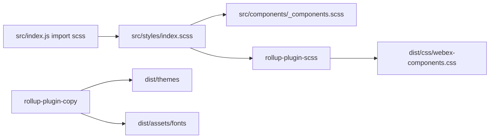
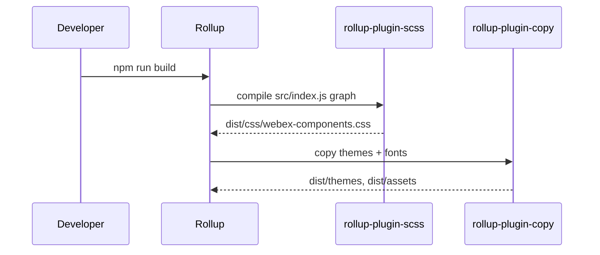

# components — src/styles/ai-docs/styles-themes-spec.md

Repositorio: webex/components
Descripcion del repositorio: Embed the power of Webex in your web applications, on your own terms 💪🏼

<!-- ───────────────────────────────
  Template:     Module Spec
  Template-ID:  module-spec
  Generates:    src/styles/ai-docs/styles-themes-spec.md
  Description:  Per-module canonical spec — orientation plus requirements, design, invariants, flows, pitfalls, and tests.
  Library ver:  0.2.1
  Last updated: 2026-07-27
─────────────────────────────── -->

# styles-themes — SPEC

> Start here → root [`AGENTS.md`](../../../AGENTS.md) · router [`SPEC_INDEX.md`](../../../ai-docs/SPEC_INDEX.md) · system [`ARCHITECTURE.md`](../../../ai-docs/ARCHITECTURE.md).

## Metadata

| Field | Value |
|---|---|
| Module id | styles-themes |
| Source path(s) | `src/styles/`, `src/themes/`, `src/assets/` |
| Doc kind | Module spec |
| Coverage score | 95% assessed 2026-07-23 — SCSS graph, themes, fonts, and build outputs documented |
| Generated from | `module-spec` @ SDLC template library `0.2.1` |
| generated_by / approved_by / updated_at | cursor-agent-session / pending PR approval / 2026-07-23 |
| Validation status | pass-with-warnings, validator codex-agent-session, assessed 2026-07-23 (0 blocking) |

## Evidence Rules

Style requirements cite SCSS entry files and Rollup copy targets. Class prefix cross-checks `src/constants.js`.

## Source Material Register

| Source material | Scope | Decision | Detail location |
|---|---|---|---|
| Component `_components.scss` | per-component styles | verified | Imported via `src/styles/index.scss` |
| Storybook | visual verification | reference-only | `.storybook/` |

## Overview

The **styles-themes** module defines global SCSS (variables, mixins, colors, fonts, defaults), dark/light theme token files, and font assets copied into `dist/` during build. Package entry `src/index.js` side-imports `src/styles/index.scss` so bundlers emit consolidated CSS.

## Purpose / Responsibility

Own visual consistency for Webex Components (`wxc-` class prefix) and deliver compiled CSS + theme assets to npm consumers. Does **not** implement component logic.

## Stack

- SCSS (sass)
- Rollup `rollup-plugin-scss` → `dist/css/webex-components.css`
- Rollup `rollup-plugin-copy` for themes and fonts

## Folder / Package Structure

```
src/styles/
├── index.scss          # Entry: imports mixins, variables, themes, components
├── _variables.scss     # SCSS variables (incl. class prefix)
├── _colors.scss
├── _mixins.scss
├── _fonts.scss
└── _defaults.scss

src/themes/
├── dark.scss
├── light.scss
├── dark/webex-logo.svg
└── light/webex-logo.svg

src/assets/fonts/       # Copied to dist/assets on build
```

## Key Files (source of truth)

| File | Holds |
|---|---|
| `src/styles/index.scss` | SCSS import graph root |
| `src/styles/_variables.scss` | Design tokens; class prefix must match `src/constants.js` |
| `src/themes/dark.scss` | Dark theme variables |
| `src/themes/light.scss` | Light theme variables |
| `rollup.config.js` | SCSS output path and copy targets |
| `src/constants.js` | `WEBEX_COMPONENTS_CLASS_PREFIX = 'wxc'` |

## Public Surface

| Contract ID | Type | Surface | Purpose | Compatibility | Detail link |
|---|---|---|---|---|---|
| styles.css.bundle | npm asset | `dist/css/webex-components.css` | Compiled styles for hosts | Additive class changes preferred | `rollup.config.js` |
| styles.themes.dark | npm asset | `dist/themes/dark/` | Dark theme static assets | Semver | `rollup.config.js` |
| styles.themes.light | npm asset | `dist/themes/light/` | Light theme assets | Semver | `rollup.config.js` |
| styles.fonts | npm asset | `dist/assets/fonts/` | Font files | Semver | `rollup.config.js` |

Internal Surface — SCSS partials are build-time, not direct public API.

## Requires (dependencies)

- `node-sass` / sass toolchain (devDependency via build)
- Component SCSS partials under `src/components/_components.scss` and per-component styles

## Requirements

| ID | WHAT | WHY | Source Evidence | Test Evidence | Gaps | Confidence |
|---|---|---|---|---|---|---|
| STY-R-001 | Package entry MUST import global SCSS | Ensures CSS emitted in library build | `src/index.js` | build output | none | PRESENT |
| STY-R-002 | Class prefix in SCSS MUST match JS constant `wxc` | Prevents broken selectors | `src/styles/_variables.scss`, `src/constants.js` | component tests | none | PRESENT |
| STY-R-003 | Rollup MUST emit compressed CSS to `dist/css/webex-components.css` | Consumer import path | `rollup.config.js` | CI build | none | PRESENT |
| STY-R-004 | Build MUST copy theme folders to `dist/themes/` | Host theme switching | `rollup.config.js` copy plugin | build artifact | none | PRESENT |
| STY-R-005 | Build MUST copy font files to `dist/assets/fonts/` | Hosts load bundled fonts | `rollup.config.js` copy plugin | CI build | none | PRESENT |
| STY-R-006 | Theme SCSS files MUST be imported from `src/styles/index.scss` | Single CSS bundle | `src/styles/index.scss` | build | none | PRESENT |
| STY-R-007 | Component styles aggregated via `src/components/_components.scss` | Component-level SCSS inclusion | `src/components/_components.scss` | build | none | PRESENT |

## Design Overview

SCSS is organized in layers: variables/mixins → color/font tokens → theme overrides → component aggregation. Themes (`dark.scss`, `light.scss`) set CSS custom properties or SCSS variables consumed by component rules. Rollup compiles a single CSS bundle for simplicity; theme folders ship as static assets for logos and theme-specific resources.

## Data Flow



## Sequence Diagram(s)

Sequence coverage:

| Operation group | Diagram | Failure / recovery coverage |
|---|---|---|
| Production build CSS + assets | below | SCSS `failOnError: true` aborts build on compile failure |



## Class / Component Relationships

- SCSS `_variables.scss` defines `$wxc-*` tokens consumed by component SCSS files.
- `helpers.js` `webexComponentClasses()` generates BEM-style class strings aligned with SCSS blocks.
- No OOP classes in this module — relationship is **token → component stylesheet → rendered DOM class**.

Evidence: `src/components/helpers.js`, `src/styles/_variables.scss`.

## Use Cases

| UC | Description | Evidence |
|---|---|---|
| UC-1 Consumer styling | Host imports `dist/css/webex-components.css` | `README.md` |
| UC-2 Theme assets | Host serves `dist/themes/dark` logos | `rollup.config.js` |
| UC-3 Component author | Add SCSS beside new component; register in `_components.scss` | `src/components/` patterns |

## SCSS File Registry

| File | Role |
|---|---|
| `src/styles/index.scss` | Entry import graph |
| `src/styles/_variables.scss` | Prefix, fonts, meeting min dimensions |
| `src/styles/_colors.scss` | Color tokens |
| `src/styles/_mixins.scss` | Shared mixins |
| `src/styles/_fonts.scss` | Font face declarations |
| `src/styles/_defaults.scss` | Base element defaults |
| `src/themes/dark.scss` | Dark theme tokens |
| `src/themes/light.scss` | Light theme tokens |
| `src/components/_components.scss` | Imports all component SCSS partials |

## Theme & Asset Assets

| Path | Role |
|---|---|
| `src/themes/dark/webex-logo.svg` | Dark theme logo |
| `src/themes/light/webex-logo.svg` | Light theme logo |
| `src/assets/fonts/` | CiscoSansTT font files copied to `dist/assets/fonts/` |

Evidence: `rollup.config.js`, `src/assets/fonts/`.

## Pitfalls

- Changing `$prefix` in SCSS without updating `WEBEX_COMPONENTS_CLASS_PREFIX` breaks tests and styles.
- SCSS compilation failures fail build (`failOnError: true` in Rollup scss plugin).
- Consumers who tree-shake JS but omit CSS see unstyled components.

Evidence: `rollup.config.js`, `src/constants.js`.

## Module Do's / Don'ts

- DO: prefix SCSS partials with `_` under `src/styles/`.
- DO: keep `$WEBEX_COMPONENTS_CLASS_PREFIX` aligned with `src/constants.js`.
- DO: register new component SCSS in `src/components/_components.scss`.
- DON'T: change `wxc-` class prefix in only JS or only SCSS.
- DON'T: expect per-component CSS tree-shaking from the single bundle model.

Evidence: `src/styles/_variables.scss`, `src/constants.js`.

## Export Stability

Published npm assets (`dist/css/`, `dist/themes/`, `dist/assets/`) follow semver via semantic-release. Prefer additive CSS classes; renaming `wxc-` prefixed classes is breaking.

Evidence: `package.json`, `README.md`.

## Host Integration & Theming

Hosts load compiled CSS once globally. Theme selection may swap CSS variables or load theme-specific assets from `dist/themes/`. Class prefix `wxc` must not be overridden without updating both JS and SCSS.

Evidence: `README.md`, `dist/css/webex-components.css`.

## Test-Case Strategy (module)

- Indirect: component snapshot tests assert expected `wxc-` classes.
- Build verification: `npm run build` produces expected dist artifacts.
- Visual: Storybook/Chromatic for theme regressions.

| Behavior / Requirement | Existing test evidence | Gap |
|---|---|---|
| STY-R-003 CSS bundle | CI build | none |
| STY-R-005 font copy | CI build / dist inspection | none |

Evidence: `.circleci/config.yml`, `rollup.config.js`.

## Traceability

| Requirement | Code | Tests |
|---|---|---|
| STY-R-001 | `src/index.js` | build |
| STY-R-002 | `src/styles/_variables.scss`, `src/constants.js` | component snapshots |
| STY-R-003 | `rollup.config.js` | CI build |
| STY-R-004 | `rollup.config.js` | CI build |
| STY-R-005 | `rollup.config.js` | CI build |
| STY-R-006 | `src/styles/index.scss` | build |
| STY-R-007 | `src/components/_components.scss` | build |

- Repo architecture: [`ai-docs/ARCHITECTURE.md`](../../../ai-docs/ARCHITECTURE.md) · Registry: [`ai-docs/SPEC_INDEX.md`](../../../ai-docs/SPEC_INDEX.md)
- Coverage state & contracts baseline: `.sdd/manifest.json`

---
> Fuente: https://github.com/webex/components/blob/master/src/styles/ai-docs/styles-themes-spec.md (licencia MIT)
