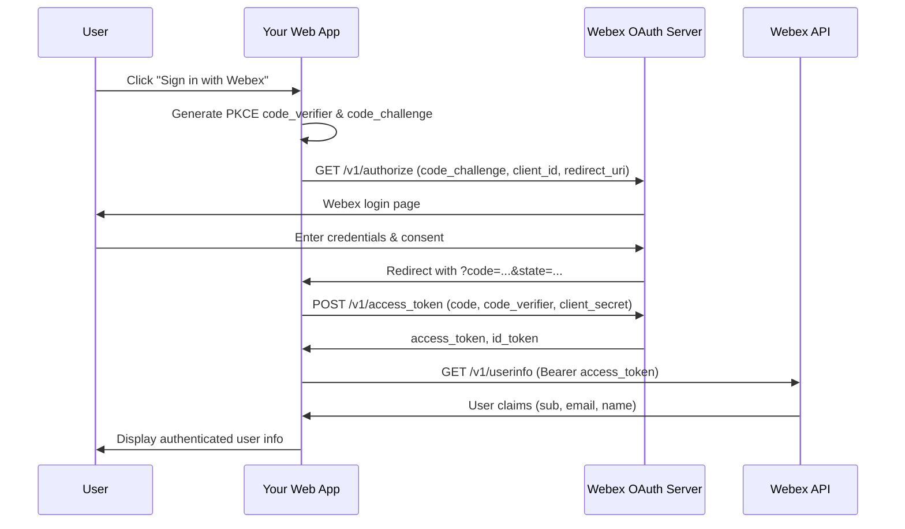

# WebexPlaybooks — playbooks/login-with-webex/diagrams/architecture-diagram.md

Repositorio: webex/WebexPlaybooks

# Login with Webex — Architecture Diagram

---
> Fuente: https://github.com/webex/WebexPlaybooks/blob/main/playbooks/login-with-webex/diagrams/architecture-diagram.md (licencia NOASSERTION)
