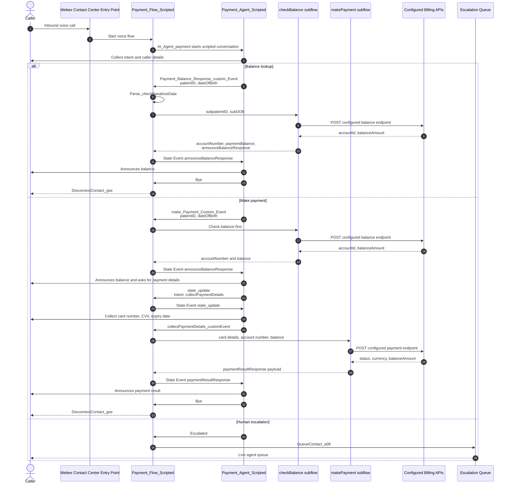

# WebexPlaybooks — playbooks/payment-ai-agent-scripted/diagrams/architecture-diagram.md

Repositorio: webex/WebexPlaybooks

# Architecture Diagram

---
> Fuente: https://github.com/webex/WebexPlaybooks/blob/main/playbooks/payment-ai-agent-scripted/diagrams/architecture-diagram.md (licencia NOASSERTION)
