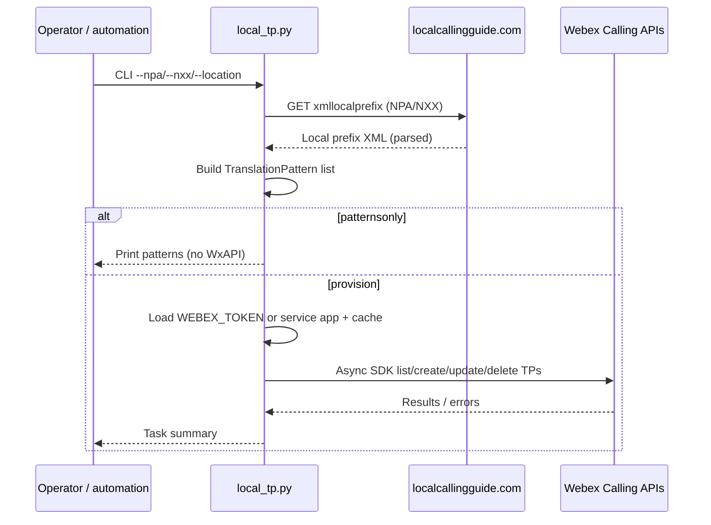

# WebexPlaybooks — playbooks/webex-calling-nanp/diagrams/architecture-diagram.md

Repositorio: webex/WebexPlaybooks

# Architecture — NANP translation patterns (webex-calling-nanp)

---
> Fuente: https://github.com/webex/WebexPlaybooks/blob/main/playbooks/webex-calling-nanp/diagrams/architecture-diagram.md (licencia NOASSERTION)
